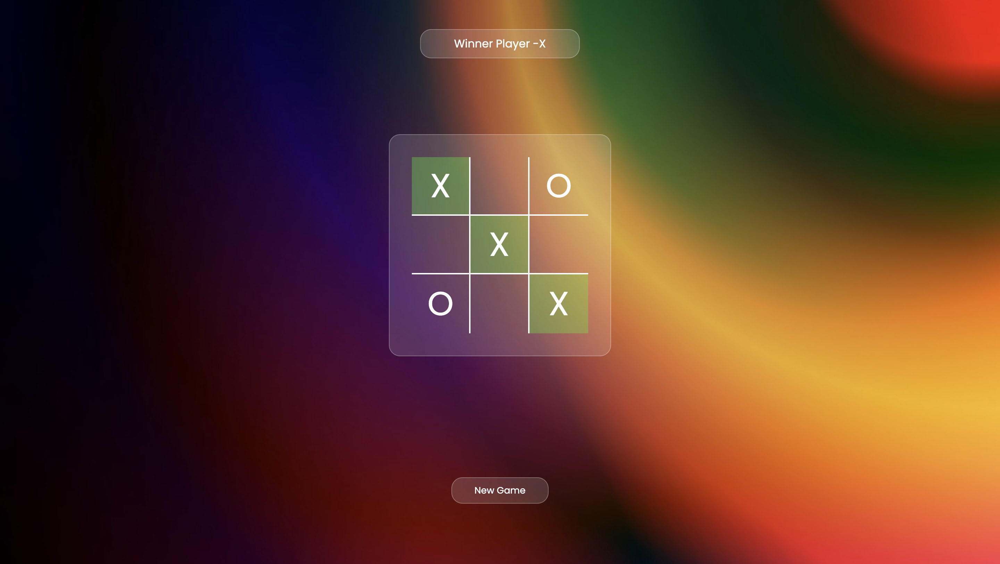

# Tic-Tac-Toe

A classic Tic-Tac-Toe web game built using HTML, CSS, and vanilla JavaScript. 

**🚀 Live Demo:** [https://tic-tac-toe-game-olive-nine.vercel.app/](https://tic-tac-toe-game-olive-nine.vercel.app/)

## Features
- **Interactive UI**: Clickable 3x3 grid for gameplay.
- **Turn Tracking**: Displays the current player's turn (X or O).
- **Win/Tie Detection**: Automatically checks for win conditions and tie scenarios.
- **Winner Highlighting**: Highlights the winning combination of boxes in a distinct color.
- **Reset Functionality**: Includes a "New Game" button to reset the board and start over.

## Technologies Used
- HTML5
- CSS3 (Custom styling, Poppins font)
- JavaScript (DOM manipulation and game logic)

## How to Play
1. The game starts with Player "X".
2. Players take turns clicking on the empty boxes to place their symbol.
3. The first player to get 3 of their symbols in a row (horizontally, vertically, or diagonally) wins the game.
4. If all 9 boxes are filled and no player has won, the game ends in a tie.
5. Click the "New Game" button at any point to reset the board and start a new match.

## Setup
To run this project locally, you simply need to open `index.html` in any modern web browser or start a local server in the project directory. No build step or package installation is required.
